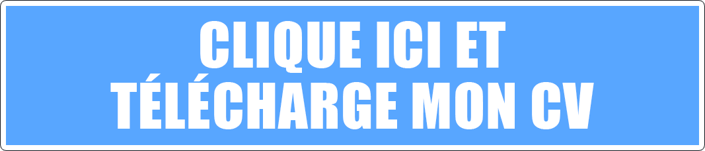

 

<ul>
   <li>
      Nom : Alves
   </li>
   <li>
      Prenom : Anthony
   </li>
   <li>
      Age : 31 ans
   </li>
   <li>
      Job : Développeur Web Back-end PHP/SYMFONY
   </li>
   <li>
      Disponible à l'embauche : ✔️
   </li>
   <li>
      Site Web : <a href="http://anthonyalves.fr/"> Mon site Web </a>
   </li>
   <li>
      Linkedin : <a href="https://www.linkedin.com/in/anthonyalves93330/"> Mon linkedin </a>
   </li>
   <li>
      instagram : <a href="https://www.instagram.com/pitimatsu/"> Mon Instagram </a>
   </li>
   <li>
      Twitter : <a href="https://twitter.com/AnthonyWebCoder"> Mon Twitter </a>
   </li>
   </ul> 

 

 

   
   
   

 

 

 

 

### MES DIPLOMES
   
    <ul>
      <li><a href="https://openclassrooms.com/">Développeur d'application - PHP / Symfony (BAC +4)</a></li>
      <li><a href="https://openclassrooms.com/">Chef de projet multimédia (BAC +4)</a></li>
      <li><a href="https://www.lyceecugnot.fr/">Bac Technologique (STI)</a></li>
      <li><a href="https://monod-gagny.webcollege.seinesaintdenis.fr/">Brevet des Collèges</a></li>
   </ul> 
   
### MES CERTIFICATIONS

    <ul>
      <li><a href="">Certification : PHP ET MYSQL (OPENCLASSROOMS)</a></li>
      <li><a href="">Certification : HTML5 ET CSS3 (OPENCLASSROOMS)</a></li>
      <li><a href="">Certification : POO EN PHP (UDEMY)</a></li>
      <li><a href="">Certification : Marketing Digital et Réseaux Sociaux (UDEMY)</a></li>
      <li><a href="">Certification : Unity5 (UDEMY)</a></li>
      <li><a href="">Certification : Git Github (UDEMY)</a></li>
      <li><a href="">Certification : BOOTSTRAP 4 (UDEMY)</a></li>
      <li><a href="">Certification : MVC AVEC PHP (OPENCLASSROOMS)</a></li>
   </ul> 

